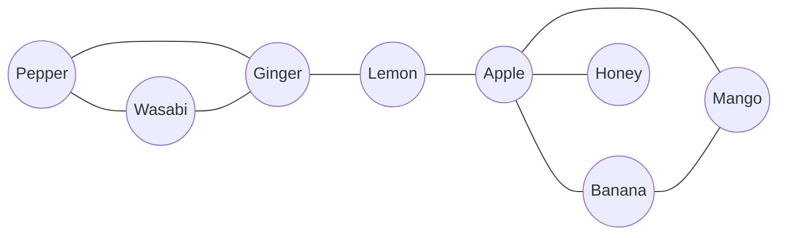
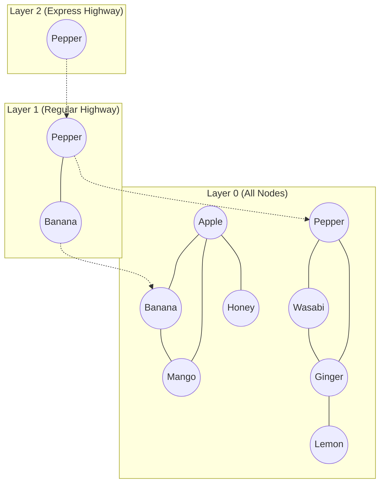
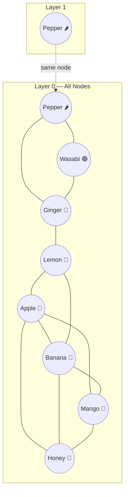
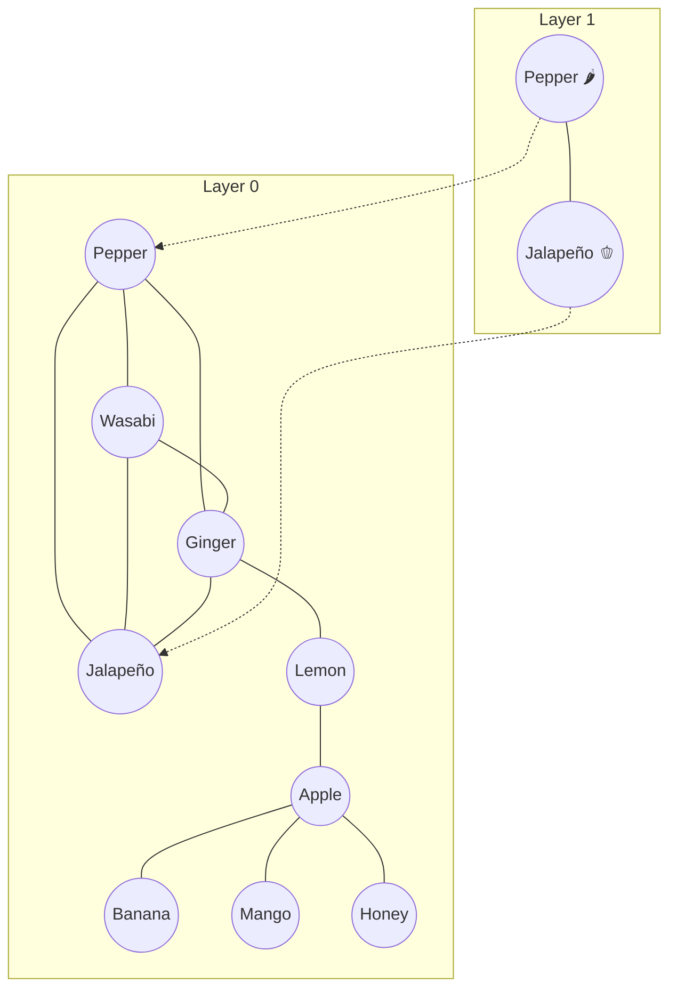

# HNSW: Hierarchical Navigable Small World — A Complete Walkthrough

## Table of Contents
1. [The Problem: Why Do We Need HNSW?](#1-the-problem)
2. [Building Blocks](#2-building-blocks)
3. [HNSW = NSW + Skip List](#3-hnsw-overview)
4. [Key Parameters](#4-key-parameters)
5. [Graph Construction — Step by Step](#5-graph-construction)
6. [Adding a New Vector to an Existing Graph](#6-adding-new-vector)
7. [ANN Search — Finding Nearest Neighbors](#7-ann-search)
8. [Summary Cheat Sheet](#8-summary)

---

## 1. The Problem: Why Do We Need HNSW? {#1-the-problem}

In a RAG system, when a user asks a question, we need to find the most similar document chunks to the query. Each chunk is stored as a **vector embedding** (e.g., a 768-dimensional array of numbers).

**The brute-force approach**: Compare the query vector to *every* stored vector, compute the distance, and return the closest ones.

| Dataset Size | Comparisons Needed | Time at 1M ops/sec |
|---|---|---|
| 1,000 vectors | 1,000 | 1 ms |
| 1,000,000 vectors | 1,000,000 | 1 second |
| 1,000,000,000 vectors | 1,000,000,000 | ~17 minutes |

> [!IMPORTANT]
> HNSW reduces search from **O(N)** to **O(log N)**. For 1 billion vectors, that's ~30 comparisons instead of 1 billion.

---

## 2. Building Blocks {#2-building-blocks}

HNSW combines two ideas. Let's understand each one first.

### 2a. Navigable Small World (NSW) Graph

Think of a social network. Even though billions of people exist, you can reach anyone through roughly 6 connections ("six degrees of separation"). This is the **small world property**.

An NSW graph connects each vector to its nearest neighbors. To search:
1. Start at any node
2. Look at all its neighbors
3. Move to the neighbor **closest** to your query
4. Repeat until no neighbor is closer than the current node (you've hit a **local minimum**)



**Problem**: With a flat (single-layer) graph, greedy search can get **stuck in local minima** — you find a node that's locally closest, but the true nearest neighbor is in a completely different part of the graph.

### 2b. Skip List

A skip list is a multi-level linked list where:
- **Bottom level**: contains ALL elements
- **Each higher level**: contains a random **subset** of elements from the level below
- Searching starts at the top (few elements, big jumps) and refines at the bottom

```
Level 2:  [3] ---------------------------------> [50]
Level 1:  [3] --------> [20] ------------------> [50]
Level 0:  [3] -> [7] -> [20] -> [25] -> [40] -> [50]
```

To find 25: Start at Level 2 → jump from 3 to 50 (too far, go down) → Level 1 → jump from 3 to 20 to 50 (too far, go down) → Level 0 → 20 → 25 ✓

> [!TIP]
> **Key insight**: Upper layers act as "express highways" that skip over large portions of the data. Lower layers act as "local streets" for precise navigation.

---

## 3. HNSW = NSW + Skip List {#3-hnsw-overview}

HNSW fuses both ideas into a **multi-layer navigable small world graph**:

| Property | From NSW | From Skip List |
|---|---|---|
| Graph structure | ✅ Each layer is a navigable graph with nearest-neighbor connections | |
| Greedy search | ✅ "Move to the closest neighbor" | |
| Hierarchy | | ✅ Multiple layers with decreasing node count |
| Search strategy | | ✅ Start at top layer, refine downward |
| Local minima fix | | ✅ Upper layers provide "long-range shortcuts" |



**Rules:**
1. **Layer 0** contains ALL nodes
2. Each higher layer contains a **random subset** of the layer below
3. If a node exists on layer L, it also exists on layers L−1, L−2, ..., 0
4. Each layer is an independent NSW graph (nodes connect to their nearest neighbors within that layer)

---

## 4. Key Parameters {#4-key-parameters}

### 4.1 The Three Knobs

| Parameter | What It Controls | Analogy |
|---|---|---|
| **M** | Max neighbors per node per layer | "How many friends each person can have" |
| **efConstruction** | Candidate list size during graph building | "How carefully we pick those friends" |
| **efSearch** | Candidate list size during querying | "How thoroughly we search the city" |

### 4.2 The Layer Assignment Formula

Each node is randomly assigned a max layer using:

$$l = \lfloor -\ln(\text{rand}(0,1)) \times mL \rfloor$$

where **mL = 1 / ln(M)** is a normalization factor.

**Numerical walkthrough** with M = 3, so mL = 1/ln(3) ≈ 0.91:

| Node | rand value (r) | −ln(r) | × mL (×0.91) | floor = Layer |
|---|---|---|---|---|
| Apple | 0.70 | 0.357 | 0.325 | **0** |
| Banana | 0.55 | 0.598 | 0.544 | **0** |
| Mango | 0.80 | 0.223 | 0.203 | **0** |
| Pepper | 0.15 | 1.897 | 1.726 | **1** |
| Wasabi | 0.60 | 0.511 | 0.465 | **0** |
| Ginger | 0.90 | 0.105 | 0.096 | **0** |
| Honey | 0.45 | 0.799 | 0.727 | **0** |
| Lemon | 0.50 | 0.693 | 0.631 | **0** |

> [!NOTE]
> Notice how **most nodes get layer 0** and only **Pepper** gets layer 1. This is by design — the exponential distribution ensures upper layers are sparse "express lanes."

---

## 5. Graph Construction — Step by Step {#5-graph-construction}

### Our Running Example

We represent 8 food items as 2D vectors: **[sweetness, spiciness]**

| Item | Vector | Assigned Layer |
|---|---|---|
| Apple 🍎 | [9, 1] | 0 |
| Banana 🍌 | [8, 0] | 0 |
| Mango 🥭 | [10, 2] | 0 |
| Pepper 🌶️ | [2, 10] | 1 |
| Wasabi 🟢 | [1, 9] | 0 |
| Ginger 🫚 | [3, 7] | 0 |
| Honey 🍯 | [10, 0] | 0 |
| Lemon 🍋 | [5, 4] | 0 |

**Parameters:** M = 3, efConstruction = 8, mL ≈ 0.91

> [!IMPORTANT]
> **Construction IS insertion**. To build an HNSW graph, you simply insert nodes one by one into an empty graph. There's no separate "build" step.

---

### Insert #1: Apple [9, 1] → Layer 0

The graph is empty, so Apple simply becomes the **entry point**.

```
Layer 0:   (Apple)        ← entry point, no connections yet
```

**State**: entry_point = Apple, max_layer = 0

---

### Insert #2: Banana [8, 0] → Layer 0

**Phase 1** — Greedy descent from top to (layer + 1):
- Banana's layer = 0, so we'd descend from max_layer(0) to layer 1 — but 0 < 1, so **this phase is skipped**.

**Phase 2** — Search and connect at layers 0...0:
- **Layer 0**: Search from Apple with ef = efConstruction = 8
  - Only Apple exists. Candidates: {Apple}
  - dist(Banana, Apple) = √((8−9)² + (0−1)²) = √2 ≈ **1.41**
- Connect: **Banana ↔ Apple**

```
Layer 0:   (Apple) ——1.41—— (Banana)
```

---

### Insert #3: Mango [10, 2] → Layer 0

**Phase 2** at Layer 0: Search from Apple with ef=8:

| Candidate | Distance to Mango [10,2] |
|---|---|
| Apple [9,1] | √((10−9)² + (2−1)²) = √2 ≈ **1.41** |
| Banana [8,0] | √((10−8)² + (2−0)²) = √8 ≈ **2.83** |

Select M=3 nearest (only 2 exist): Apple, Banana

Connect: **Mango ↔ Apple**, **Mango ↔ Banana**

```
Layer 0:   (Banana) ——1.41—— (Apple) ——1.41—— (Mango)
              \                                  /
               \——————————2.83————————————————--/
```

---

### Insert #4: Pepper [2, 10] → Layer 1 ⭐

This is the first node assigned to **Layer 1** — the first "express lane" node!

**Phase 1**: Pepper's layer (1) > current max_layer (0), so descent phase is skipped.

**Phase 2**: Search and connect at layers min(0, 1) = 0 down to 0:

**Layer 0**: Search from entry point (Apple) with ef=8. Explore the graph:

| Candidate | Distance to Pepper [2,10] |
|---|---|
| Apple [9,1] | √(49 + 81) = √130 ≈ **11.40** |
| Mango [10,2] | √(64 + 64) = √128 ≈ **11.31** |
| Banana [8,0] | √(36 + 100) = √136 ≈ **11.66** |

Select M=3 nearest: Mango (11.31), Apple (11.40), Banana (11.66)

Connect Pepper to all three at layer 0.

**Update entry point**: Pepper's layer (1) > max_layer (0), so **Pepper becomes the new entry point** and max_layer = 1.

```
Layer 1:   (Pepper)          ← NEW entry point, alone on layer 1

Layer 0:   (Banana)——(Apple)——(Mango)
              \         |        /
               \------(Pepper)--/
```

> [!NOTE]
> Pepper is far from the "sweet" cluster (Apple, Banana, Mango) in vector space, but it still connects to them because they're the only nodes available. These "long-range" connections are actually useful — they provide shortcuts across the graph.

---

### Insert #5: Wasabi [1, 9] → Layer 0

**Phase 1**: Greedy descent from Layer 1 to Layer 1 (since Wasabi's layer = 0, we descend to layer 0+1=1):
- Layer 1: Only Pepper exists. dist(Wasabi, Pepper) = √((1−2)² + (9−10)²) = √2 ≈ **1.41**. Entry point for next layer = Pepper.

**Phase 2** at Layer 0: Search from Pepper with ef=8:
- Start at Pepper. Explore its neighbors: Mango, Apple, Banana
- From Apple, explore its neighbors: Banana (visited), Mango (visited)
- Candidates: {Pepper (1.41), Apple (11.31), Mango (11.40), Banana (11.40)}
- Select M=3 nearest: **Pepper, Apple, Mango**

Connect: **Wasabi ↔ Pepper, Wasabi ↔ Apple, Wasabi ↔ Mango**

---

### Insert #6: Ginger [3, 7] → Layer 0

**Phase 1**: Layer 1 → entry point is Pepper.
- dist(Ginger, Pepper) = √(1 + 9) = √10 ≈ **3.16**. Use Pepper as entry for layer 0.

**Phase 2** at Layer 0: Search from Pepper:
- Pepper's neighbors: Mango, Apple, Banana, Wasabi
- dist(Ginger, Wasabi) = √(4+4) = √8 ≈ **2.83** — closer! Move to Wasabi.
- From Wasabi, check neighbors: Pepper (visited), Apple (visited), Mango (visited)
- Candidates sorted: {**Wasabi (2.83)**, Pepper (3.16), Apple (8.49), Banana (8.60), Mango (8.60)}
- Select M=3 nearest: **Wasabi, Pepper, Apple**

> [!TIP]
> **This insertion demonstrates greedy navigation in action.** We started at Pepper (entry point from layer 1), but the search moved to Wasabi because it was closer to Ginger. The algorithm "walks" through the graph toward the query.

---

### Inserts #7–8: Honey [10,0] and Lemon [5,4]

Same process. After all 8 insertions, the graph looks like:



We can see two natural **clusters** emerging:
- **Sweet cluster**: Apple, Banana, Mango, Honey (top-right in vector space)
- **Spicy cluster**: Pepper, Wasabi, Ginger (top-left in vector space)
- **Lemon** sits in between, bridging the two clusters

---

## 6. Adding a New Vector to an Existing Graph {#6-adding-new-vector}

> [!IMPORTANT]
> Adding a new vector uses the **exact same algorithm** as construction. There is no difference — `insert()` is `insert()`, whether the graph has 0 nodes or 10 million nodes.

### Example: Insert Jalapeño [3, 9]

Let's say Jalapeño gets assigned **layer 1**.

#### Step 1: Assign Layer

```
rand(0,1) = 0.18
l = floor(-ln(0.18) × 0.91) = floor(1.714 × 0.91) = floor(1.56) = 1
```

Jalapeño will exist on **Layer 0 and Layer 1**.

#### Step 2: Phase 1 — Greedy Descent

Jalapeño's layer (1) = max_layer (1), so the descent loop (from max_layer to layer+1 = 2) doesn't execute. No descent needed.

#### Step 3: Phase 2 — Search and Connect

**Layer 1**: Search from Pepper (entry point) with ef=8:
- Only Pepper on layer 1. dist(Jalapeño, Pepper) = √((3−2)² + (9−10)²) = √2 ≈ **1.41**
- Connect: **Jalapeño ↔ Pepper** at Layer 1

**Layer 0**: Search from Pepper with ef=8. The greedy search explores the graph:

| Step | Current Node | Action | 
|---|---|---|
| 1 | Pepper [2,10] | dist = 1.41. Check neighbors: Wasabi, Ginger, Mango, Apple, Banana |
| 2 | Wasabi [1,9] | dist = 2.00. Already explored from Pepper's neighbors |
| 3 | Ginger [3,7] | dist = 2.00. Check its neighbors |

Final candidates sorted by distance to Jalapeño [3,9]:

| Candidate | Distance |
|---|---|
| **Pepper** [2,10] | √2 ≈ **1.41** |
| **Wasabi** [1,9] | √(4+0) = **2.00** |
| **Ginger** [3,7] | √(0+4) = **2.00** |
| Lemon [5,4] | √(4+25) ≈ 5.39 |
| Apple [9,1] | √(36+64) = 10.00 |
| ... | ... |

Select M=3 nearest: **Pepper, Wasabi, Ginger**

Connect Jalapeño to each of these at Layer 0 with bidirectional edges.

#### Step 4: Check Entry Point Update

Jalapeño's layer (1) = max_layer (1), so **no update** needed. (Update only happens when the new node's layer *exceeds* the current max.)

#### Final Graph After Insertion



---

## 7. ANN Search — Finding Nearest Neighbors {#7-ann-search}

### Query: "Find the 3 nearest neighbors to Sriracha [4, 8]"

**Parameters**: K = 3 (return top 3), efSearch = 10 (candidate budget)

#### Step 1: Start at the Top Layer

Entry point = **Pepper** on **Layer 1**.

#### Step 2: Greedy Descent (Layer 1 → Layer 0)

At Layer 1, search with ef = 1 (we just want the single closest node to navigate from):

| Node on Layer 1 | Distance to Sriracha [4,8] |
|---|---|
| Pepper [2,10] | √((4−2)² + (8−10)²) = √(4+4) = √8 ≈ **2.83** |
| Jalapeño [3,9] | √((4−3)² + (8−9)²) = √(1+1) = √2 ≈ **1.41** |

Start at Pepper (entry point). Check Pepper's Layer 1 neighbor: Jalapeño.
Jalapeño (1.41) is closer than Pepper (2.83) → move to **Jalapeño**.
No more unvisited neighbors on Layer 1. Best node = **Jalapeño**.

**Descend to Layer 0** using Jalapeño as the starting point.

#### Step 3: Layer 0 — Full Search with ef = 10

Now we do a thorough search on Layer 0 starting from Jalapeño, maintaining up to 10 candidates:

**Iteration 1**: Start with Jalapeño [3,9], dist = 1.41
- Check Jalapeño's neighbors: Pepper, Wasabi, Ginger

| Candidate | Distance to Sriracha [4,8] |
|---|---|
| Jalapeño [3,9] | **1.41** |
| Ginger [3,7] | √(1+1) = **1.41** |
| Pepper [2,10] | **2.83** |
| Wasabi [1,9] | √(9+1) = **3.16** |

**Iteration 2**: Pop closest unvisited = Ginger [3,7], dist = 1.41
- Check Ginger's neighbors: Wasabi (visited), Pepper (visited), Lemon

| Candidate | Distance |
|---|---|
| Ginger [3,7] | **1.41** |
| Jalapeño [3,9] | **1.41** |
| Pepper [2,10] | **2.83** |
| Wasabi [1,9] | **3.16** |
| Lemon [5,4] | √(1+16) ≈ **4.12** |

**Iteration 3**: Pop Pepper [2,10], dist = 2.83
- Check Pepper's unvisited Layer 0 neighbors: Mango, Apple, Banana (depending on connections)
- These are all far away (dist > 8). They're added to candidates but don't improve top results.

**Iteration 4**: Pop Wasabi [1,9], dist = 3.16
- Check Wasabi's unvisited neighbors. All either visited or far away.

**Iterations 5+**: Remaining candidates are farther than our worst result → **STOP**.

#### Step 4: Return Top K = 3 Results

| Rank | Node | Distance | 
|---|---|---|
| 🥇 #1 | **Ginger** [3, 7] | √2 ≈ **1.41** |
| 🥈 #2 | **Jalapeño** [3, 9] | √2 ≈ **1.41** |
| 🥉 #3 | **Pepper** [2, 10] | √8 ≈ **2.83** |

#### Verification: Brute-Force Distances

| Node | Distance to Sriracha [4,8] |
|---|---|
| **Ginger** [3,7] | **1.41** ✅ |
| **Jalapeño** [3,9] | **1.41** ✅ |
| **Pepper** [2,10] | **2.83** ✅ |
| Wasabi [1,9] | 3.16 |
| Lemon [5,4] | 4.12 |
| Mango [10,2] | 8.49 |
| Apple [9,1] | 8.60 |
| Banana [8,0] | 8.94 |
| Honey [10,0] | 10.00 |

> [!TIP]
> In this case, HNSW found the **exact** 3 nearest neighbors while visiting only ~6 nodes out of 9 total. With millions of vectors, the savings are enormous — O(log N) vs O(N).

### Why Is It "Approximate"?

HNSW doesn't guarantee finding the true nearest neighbor because:
1. **Greedy navigation** may lead to a local minimum in the wrong neighborhood
2. **Limited ef budget** means we don't explore every path
3. **Random layer assignments** mean the graph structure varies by seed

In practice, HNSW achieves **>95% recall** (finds the true nearest neighbor 95%+ of the time) with proper parameter tuning.

---

## 8. Summary Cheat Sheet {#8-summary}

### The Three Operations at a Glance

```
┌─────────────────────────────────────────────────────────────────┐
│                     CONSTRUCTION                                │
│  For each vector:                                               │
│    1. Assign random layer: l = floor(-ln(rand) × mL)            │
│    2. Greedy descent from top to l+1 (ef=1)                     │
│    3. At layers l...0: search(ef=efConstruction), connect to M  │
│    4. If l > max_layer: update entry point                      │
│                                                                 │
│  Construction IS repeated insertion. Same algorithm.            │
└─────────────────────────────────────────────────────────────────┘

┌─────────────────────────────────────────────────────────────────┐
│                      INSERTION                                  │
│  Identical to construction. Just call insert() on the           │
│  existing graph. Works the same whether graph has 0 or 10M      │
│  nodes.                                                         │
└─────────────────────────────────────────────────────────────────┘

┌─────────────────────────────────────────────────────────────────┐
│                      ANN SEARCH                                 │
│    1. Start at entry point on top layer                         │
│    2. Greedy descent from top to layer 1 (ef=1)                 │
│    3. At layer 0: search with ef=efSearch candidates            │
│    4. Return top-K from candidate list                          │
└─────────────────────────────────────────────────────────────────┘
```

### Parameter Tuning Guide

| Want to... | Adjust | Trade-off |
|---|---|---|
| Better recall (accuracy) | ↑ efSearch | Slower queries |
| Better graph quality | ↑ efConstruction | Slower build time |
| More connections | ↑ M | More memory, better recall |
| Faster queries | ↓ efSearch | Lower recall |
| Less memory | ↓ M | Fewer connections, may hurt recall |

### How HNSW Fits in RAG


In a RAG pipeline:
1. Documents are chunked and embedded into vectors
2. Vectors are inserted into an HNSW index (construction)
3. When a query arrives, it's embedded and searched against the index (ANN search)
4. The top-K most similar chunks become the context for the LLM

### C++ Implementation

A complete, runnable C++ implementation is provided at:
[hnsw.cpp](file:///home/midnight/Documents/IIITD/Research/HNSW/hnsw.cpp)

Compile and run:
```bash
g++ -std=c++17 -o hnsw hnsw.cpp -lm
./hnsw
```
